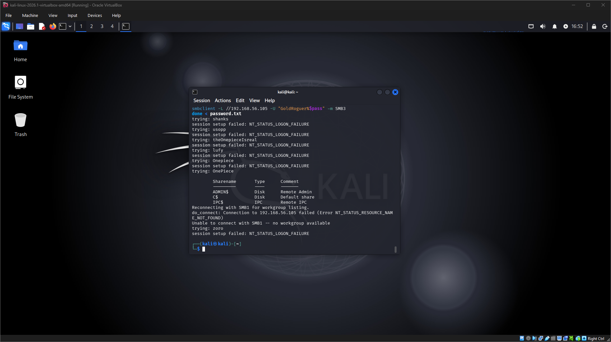
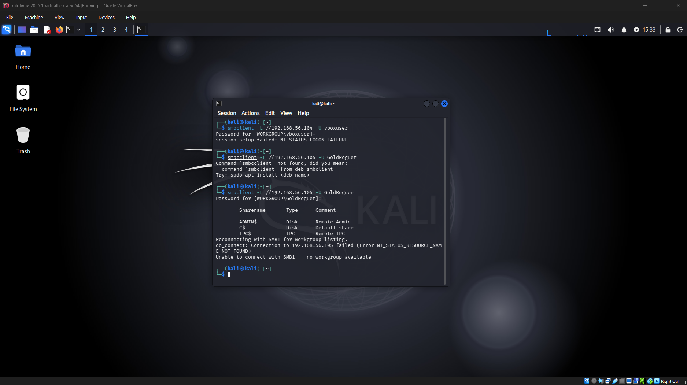
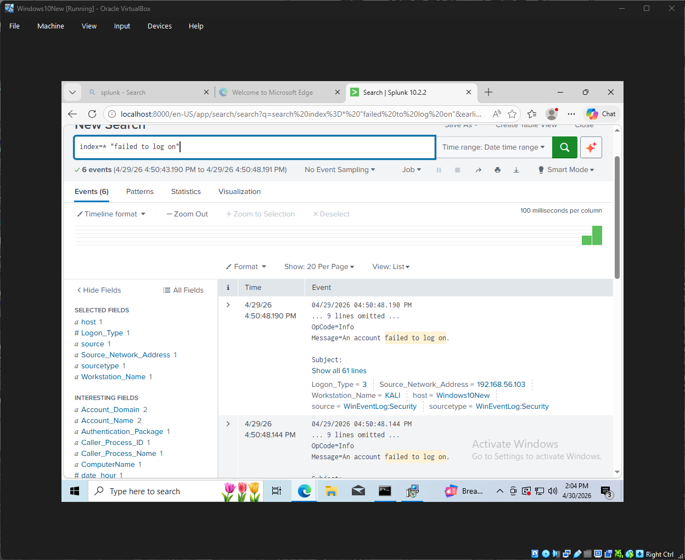
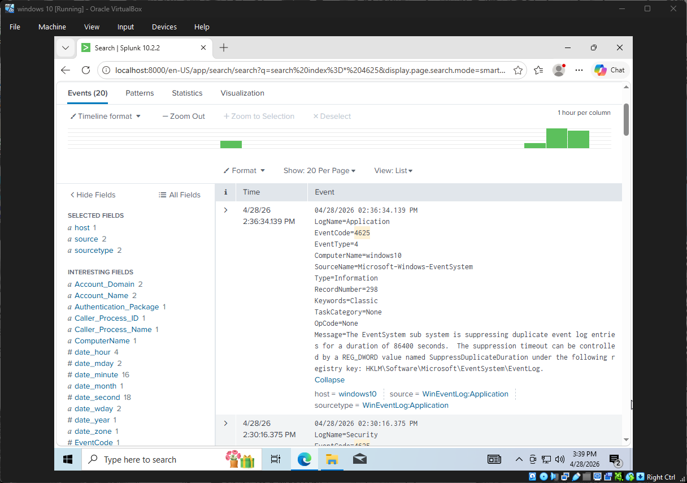
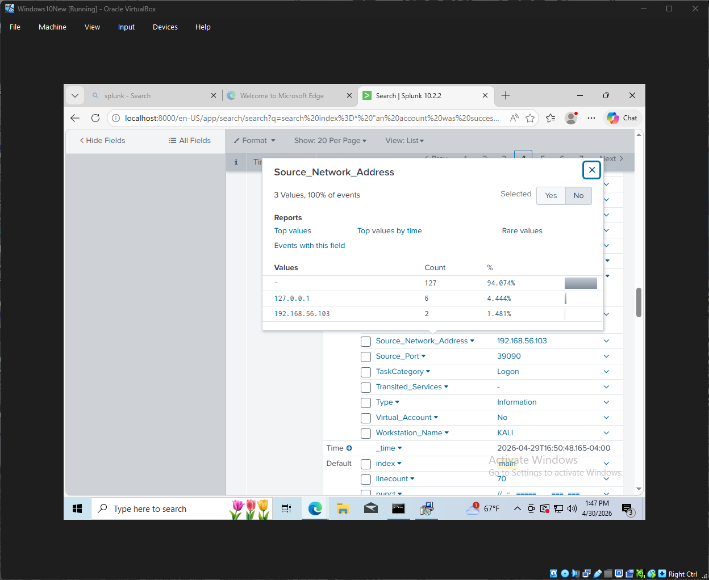
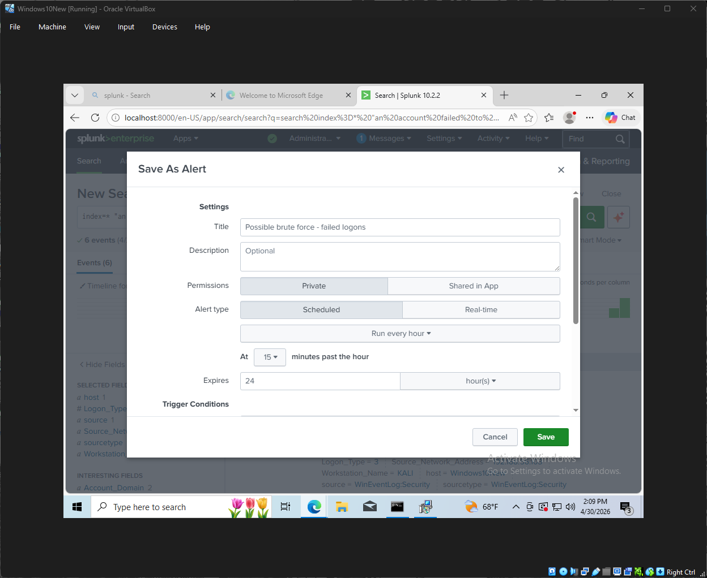
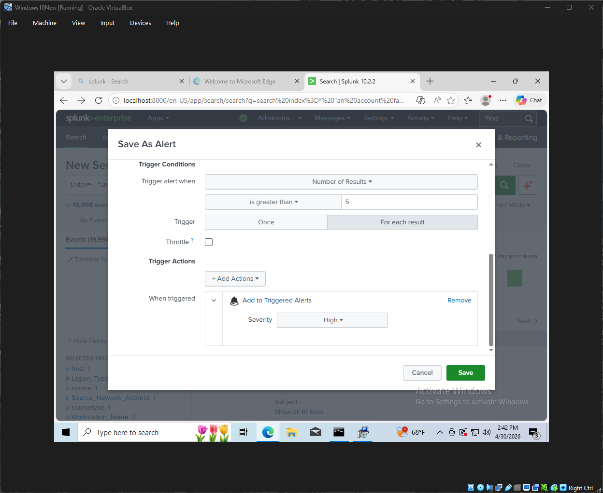
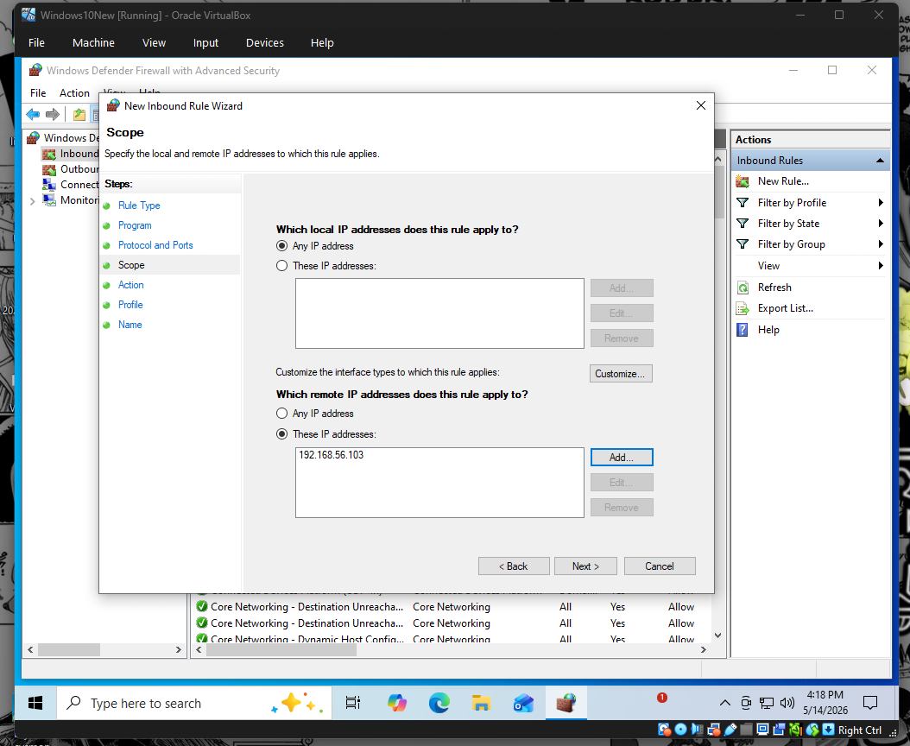
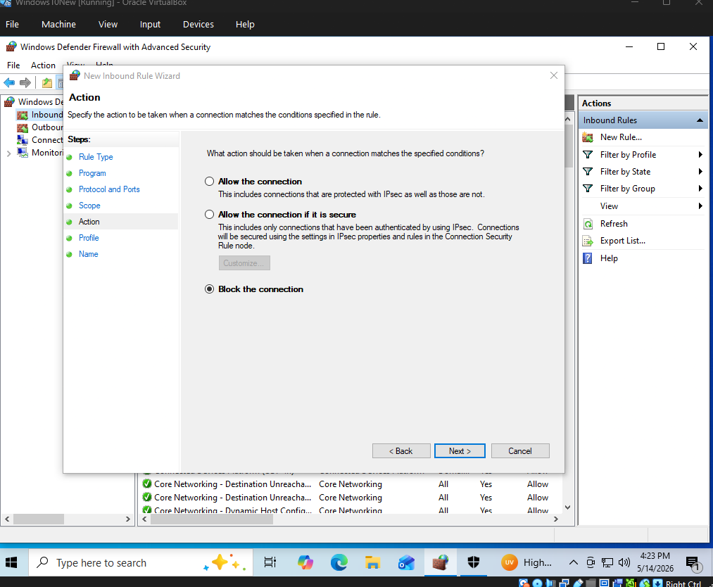
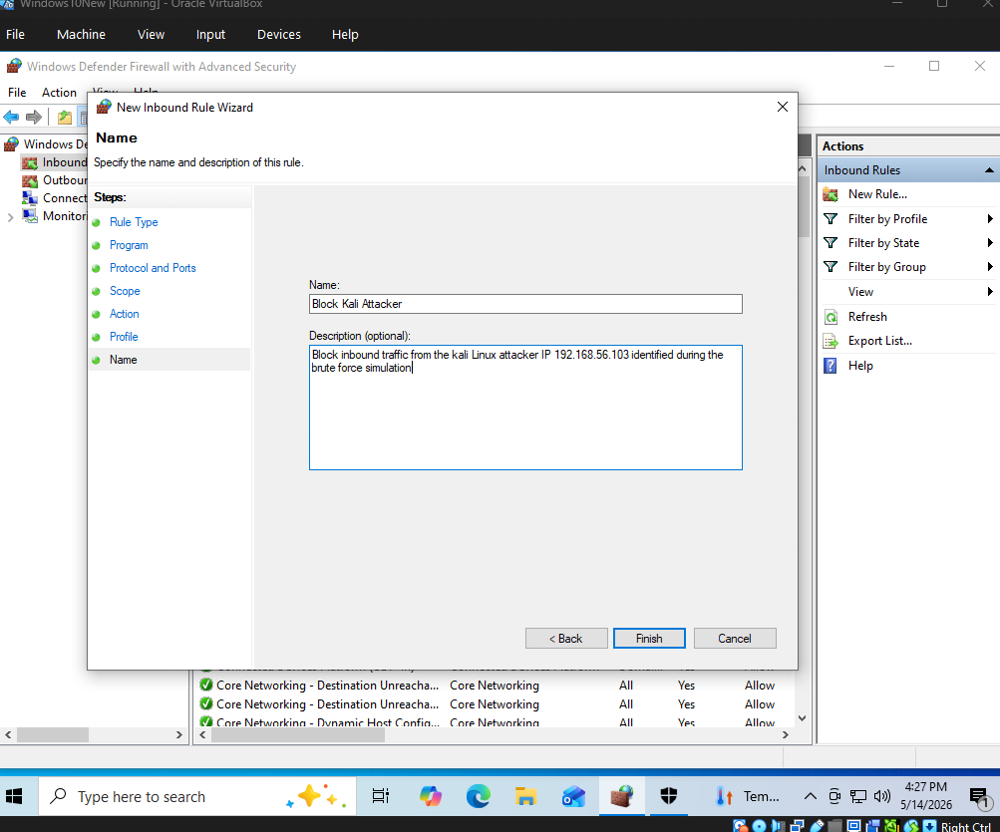

# Brute Force Attack Detection Lab Using Splunk

## Overview

This lab simulates a brute force authentication attack from a Kali Linux machine against a Windows 10 target over SMB.  
The objective was to generate failed and successful authentication events, ingest those logs into Splunk, investigate the activity, create an alert for repeated failed logons, and apply a basic containment action by blocking the attacker.

---

## Lab Objectives

- Simulate repeated SMB authentication attempts from Kali Linux
- Generate Windows Security Event ID 4625 failed logon events
- Identify the source IP address responsible for the activity
- Confirm a successful authentication event using Event ID 4624
- Investigate the brute force pattern in Splunk
- Create a Splunk alert for multiple failed logon attempts
- Apply a containment measure using Windows Defender Firewall

---

## Lab Environment

| Component | Role |
|---|---|
| Windows 10 VM | Target system |
| Kali Linux VM | Simulated attacker |
| Splunk Enterprise | SIEM/log analysis platform |
| Windows Security Logs | Authentication telemetry |
| SMB | Authentication target/protocol |

---

## Network Information

### Windows Target
The Windows 10 machine used the following lab IP address:
192.168.56.105

### Kali Attacker

The Kali Linux machine was used to simulate the attacking host in the lab environment.

Its IP address was:

```text
192.168.56.103
```


---

## Password List Used

A small password list was created in Kali Linux to simulate repeated SMB authentication attempts against the Windows target.

```text
shanks
usopp
theOnepieceIsreal
lufy
Onepiece
OnePiece
zoro
```


---

## Brute Force Simulation

The attack was simulated from Kali Linux by attempting multiple SMB authentications against the Windows 10 target.

The Windows target IP address was:

```text
192.168.56.105
```

Several password attempts failed before one valid credential successfully authenticated.



---

## Successful SMB Authentication

After several failed login attempts, one credential successfully authenticated against the Windows system.

This confirmed that the simulation produced both:

- Multiple failed authentication attempts
- One successful authentication after the failed attempts



---

## Splunk Investigation

### Failed Logon Search

To identify failed authentication activity, the following Splunk search was used:

```spl
index=* "failed to log on"
```

This search returned multiple failed logon events generated during the brute force simulation.



---

## Windows Event ID 4625 Analysis

The failed authentication attempts were recorded in Windows Security Logs as:

```text
EventCode: 4625
```

Event ID 4625 means:

```text
An account failed to log on
```

A detailed review of the event showed the following relevant fields:

```text
Failure_Reason: Unknown user name or bad password
Logon_Type: 3
Source_Network_Address: 192.168.56.103
Workstation_Name: KALI
```

### Why These Fields Matter

- `EventCode 4625` confirms a failed login attempt.
- `Logon_Type 3` indicates a network-based authentication attempt.
- `Source_Network_Address` identifies the IP address where the attempt originated.
- `Workstation_Name: KALI` confirms the activity came from the Kali Linux VM.



---

## Identifying the Attacker Source IP

The `Source_Network_Address` field was reviewed in Splunk to determine which system generated the authentication attempts.

The attacker IP address identified in the logs was:

```text
192.168.56.103
```

This matched the IP address previously confirmed on the Kali Linux attacker VM.



---

## Successful Logon Detection

To determine whether the repeated authentication attempts eventually succeeded, the following Splunk search was used:

```spl
index=* "an account was successfully logged on"
```

This search identified a successful authentication event that occurred after the failed attempts.


---

## Windows Event ID 4624 Analysis

The successful authentication was recorded as:

```text
EventCode: 4624
```

Event ID 4624 means:

```text
An account was successfully logged on
```

Relevant fields included:

```text
Account_Name: GoldRoguer
Logon_Type: 3
Source_Network_Address: 192.168.56.103
Workstation_Name: KALI
```

This confirmed that the same source IP responsible for the failed logon attempts later achieved a successful authentication.

---

## Detection Logic

The suspicious behavior identified in this lab followed this pattern:

```text
Multiple failed network logon attempts
            ↓
Same source IP address
            ↓
Successful network logon
```

This pattern is relevant to SOC investigations because it may indicate:

- Password guessing
- Brute force authentication activity
- Credential compromise after repeated failures

---

## Splunk Alert Creation

A Splunk alert was created to identify possible brute force activity based on repeated failed authentication attempts.

### Alert Name

```text
Possible brute force - failed logons
```



---

## Alert Trigger Configuration

The alert was configured to trigger when the number of matching failed logon events exceeded a defined threshold.

### Trigger Condition

```text
Number of results is greater than 5
```

### Severity

```text
High
```

This means the alert would fire when Splunk detects more than five matching failed login events within the configured time window.



---

## Basic Containment Action

After identifying the source of the suspicious authentication activity, a Windows Defender Firewall rule was created as a basic containment action.

### Firewall Rule Name

```text
Block Kali Attacker
```

This step represents a simple incident response measure after identifying a suspicious host in the lab environment.







---

## Key Findings

- Splunk successfully ingested Windows Security authentication logs.
- Repeated SMB login failures were visible through Windows Event ID 4625.
- The attacker source IP was identified as `192.168.56.103`.
- The workstation name `KALI` further confirmed the source of the activity.
- A successful login was detected using Windows Event ID 4624.
- The same source IP appeared in both failed and successful authentication activity.
- A Splunk alert was created to detect potential brute force behavior.
- A basic firewall containment action was documented.

---

## Skills Demonstrated

- Splunk Enterprise log investigation
- Windows Security Event Log analysis
- Event ID 4625 failed logon investigation
- Event ID 4624 successful logon investigation
- Source IP identification
- Network logon analysis using `Logon_Type 3`
- Brute force attack simulation in a controlled lab
- Alert creation in Splunk
- Basic incident response and containment documentation

---

## Conclusion

This lab demonstrated how a brute force authentication attempt can be simulated, detected, investigated, and partially contained using Splunk and Windows Security logs.

By reviewing repeated Event ID 4625 failed logon events, identifying the attacker IP address, correlating the activity with a later Event ID 4624 successful logon, and creating a Splunk alert, the lab reproduced a realistic SOC workflow for investigating suspicious authentication activity.
